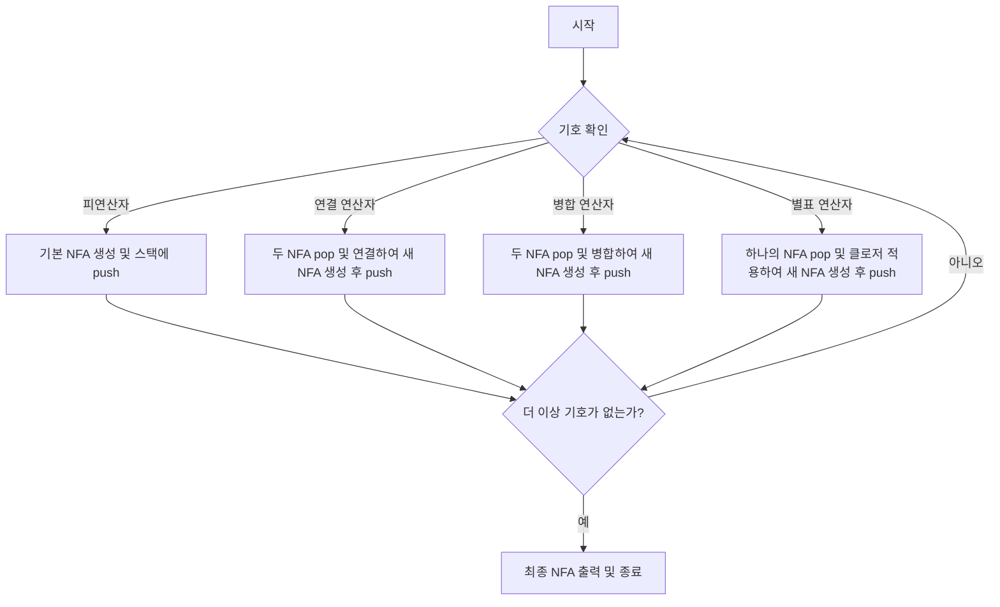
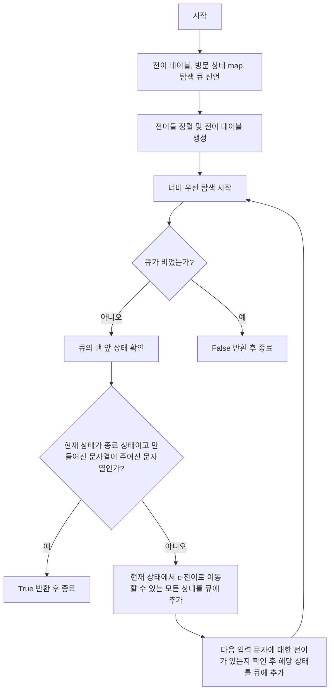

# 알고리즘
## Regular Expression to NFA
1. 정규 표현식의 각 기호에 대해 반복한다. (기호는 연산자 또는 피연산자)
2. 만약 기호가 피연산자라면, 즉 알파벳 문자와 같은 입력 기호라면 이를 인식하는 기본 NFA를 생성한다. 이 NFA는 하나의 시작 상태와 하나의 종료 상태를 가지며, 시작 상태에서 종료 상태로의 전이는 해당 피연산자를 인식하는 데 사용된다. 그리고 생성된 NFA를 스택에 push한다.
3. 만약 기호가 연산자라면, 스택에서 필요한 수만큼의 NFA를 pop하여 연산을 수행한다.
- 연결 연산자: 스택에서 두NFA를 pop하고, 첫 번째 NFA의 종료 상태와 두 번째 NFA의 시작 상태를 연결하여 새로운 NFA를 만든다.
- 병합(OR) 연산자: 스택에서 두 NFA를 pop하고, 새로운 시작 상태와 종료 상태를 만들어 첫 번째와 두 번째 NFA 사이에 병합하여 새로운 NFA를 만든다.
- 별표(Kleene star) 연산자: 스택에서 하나의 NFA를 pop하고, 시작 상태와 종료 상태 사이에 앱실론 전이를 추가하여 새로운 NFA를 만든다.
- 생성된 새로운 NFA를 다시 스택에 push한다.
4. 정규 표현식의 모든 기호를 처리한 후, 스택의 맨 위에 있는 NFA가 최종적으로 생성된 NFA가 된다.
5. 최종 NFA를 화면에 출력한다.

## flow chart

## String acceptance module
1. 전이 테이블(`table`)과 방문 상태(`visited`)를 저장하는 map, 그리고 탐색할 상태를 저장하는 큐(`q`)를 선언한다.
2. 주어진 전이들(`transitions`)을 정렬하고, 이를 바탕으로 전이 테이블을 생성한다. 전이 테이블은 현재 상태와 입력 문자를 키로, 다음 상태를 값으로 가지는 map이다.
3. 너비 우선 탐색(BFS)을 이용하여 주어진 문자열이 인식되는지 확인한다. 초기 상태를 큐에 추가하고, 큐가 빌 때까지 다음 과정을 반복한다.
- 큐의 맨 앞 상태를 가져온다. 만약 이 상태가 종료 상태이고, 지금까지 만들어진 문자열이 주어진 문자열과 같다면 true를 반환한다. 이는 해당 NFA가 주어진 문자열을 인식한다는 것을 의미한다.
- 현재 상태에서 ε-전이로 이동할 수 있는 모든 상태를 큐에 추가한다. ε-전이는 입력 없이 상태를 변경할 수 있는 전이를 의미한다.
- 다음 입력 문자에 대한 전이가 있다면, 해당 전이로 이동하는 상태를 큐에 추가한다.
4. 모든 상태를 탐색한 후에도 주어진 문자열을 인식하는 종료 상태를 찾지 못했다면 false를 반환한다. 이는 해당 NFA가 주어진 문자열을 인식하지 않는다는 것을 의미한다.

## flow chart

