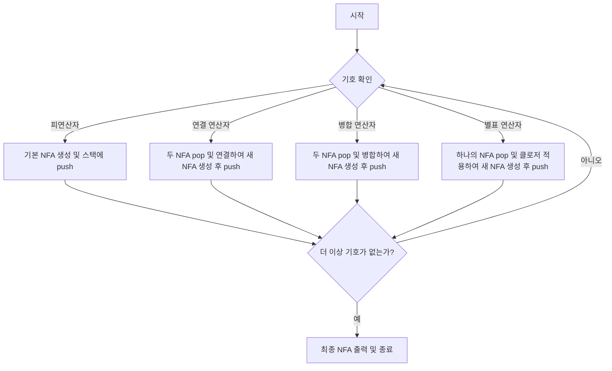

# NFA

# 알고리즘
1. 정규 표현식의 각 기호에 대해 반복한다. (기호는 연산자 또는 피연산자)
2. 만약 기호가 피연산자라면, 즉 알파벳 문자와 같은 입력 기호라면 이를 인식하는 기본 NFA를 생성한다. 이 NFA는 하나의 시작 상태와 하나의 종료 상태를 가지며, 시작 상태에서 종료 상태로의 전이는 해당 피연산자를 인식하는 데 사용된다. 그리고 생성된 NFA를 스택에 push한다.
3. 만약 기호가 연산자라면, 스택에서 필요한 수만큼의 NFA를 pop하여 연산을 수행한다.
- 연결 연산자: 스택에서 두NFA를 pop하고, 첫 번째 NFA의 종료 상태와 두 번째 NFA의 시작 상태를 연결하여 새로운 NFA를 만든다.
- 병합(OR) 연산자: 스택에서 두 NFA를 pop하고, 새로운 시작 상태와 종료 상태를 만들어 첫 번째와 두 번째 NFA 사이에 병합하여 새로운 NFA를 만든다.
- 별표(Kleene star) 연산자: 스택에서 하나의 NFA를 pop하고, 시작 상태와 종료 상태 사이에 앱실론 전이를 추가하여 새로운 NFA를 만든다.
- 생성된 새로운 NFA를 다시 스택에 push한다.
4. 정규 표현식의 모든 기호를 처리한 후, 스택의 맨 위에 있는 NFA가 최종적으로 생성된 NFA가 된다.
5. 최종 NFA를 화면에 출력한다.

# flow chart

